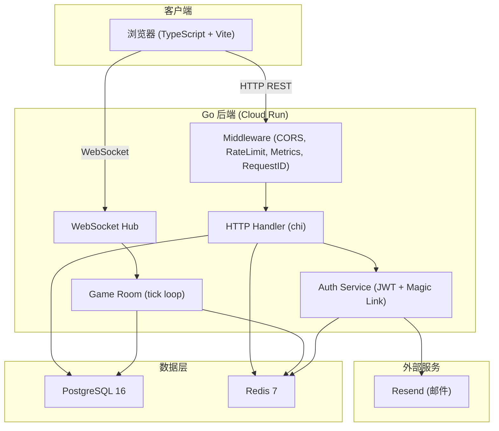
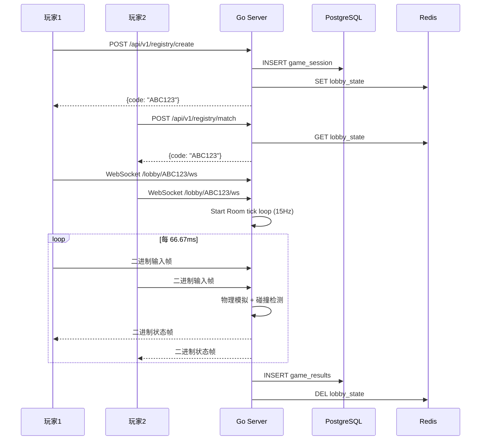

# 系统架构文档

> 最后更新: 2026-06-23
> 维护者: 项目团队

## 系统概述

多人网页气球飞行对战游戏。玩家通过浏览器创建/加入房间，实时 WebSocket 对战。

## 架构图

## 数据流

### 游戏流程

## 技术选型 ADR

参见 `docs/adr/` 目录下的各 ADR 文档。

## 当前局限性

1. **有状态 Hub**: 所有房间在单进程内存中，无法水平扩展
2. **单点 tick 循环**: Room 的物理模拟在单个 goroutine 中，受限于单核
3. **消息队列已引入**: 游戏结果通过 Redis Stream 异步写入（ADR-007），但批量消费仍可优化
4. **无 CDN**: 静态资源直接由 Go 服务，未利用边缘缓存

## 流量增长瓶颈分析

| 流量倍数 | 最先崩溃的组件 | 原因 | 应对方案 |
|----------|---------------|------|---------|
| 10x | Hub 内存 | 房间数增加 10 倍，内存 OOM | 房间状态外置到 Redis |
| 100x | WebSocket 连接数 | 单机 fd 限制 (~65K) | Hub 分片 + 多实例 |
| 100x | PostgreSQL 写入 | game_results INSERT 并发 | 读写分离 + 批量写入 |
| 1000x | 物理模拟 CPU | tick 循环占满单核 | 房间调度到独立 Worker |

### 100x 场景深度分析

当前单实例支持约 100 房间 / 500 并发连接。100x 意味着 10,000 房间 / 50,000 连接，需要以下架构升级：

#### 缓存层方案

ListLobbies、CheckRoom 当前直接查 PG，高 QPS 下成为瓶颈。

- **策略**: Redis 作为读缓存，TTL 30s，写穿透（Write-Through）
- **实现**: 房间创建/删除时同步更新 Redis 缓存 + PG；读请求优先查 Redis，miss 时回源 PG 并回填
- **缓存键**: `lobby:list` (列表缓存)、`lobby:check:{code}` (单房间缓存)
- **一致性窗口**: 30s TTL 内可能读到旧数据，对游戏大厅列表可接受
- **详见**: `docs/adr/006-cache-layer.md`

#### 队列解耦方案

游戏结果当前同步写 PG，高并发时成为瓶颈。

- **策略**: 游戏结果写入 Redis Stream → Worker 消费批量写入 PG
- **实现**: Room 结束时 XADD 到 `game:results` Stream；Worker XREADGROUP 消费，每 100 条或 1s 批量 INSERT
- **容错**: Worker 消费失败时消息留在 Pending 列表，其他 Worker 可 XCLAIM 接管
- **详见**: `docs/adr/007-message-queue.md`

#### 容量规划

| 资源 | 单实例容量 | 100x 所需 | 方案 |
|------|-----------|----------|------|
| WebSocket 连接 | ~500 (1K 上限) | 50,000 | 100 实例 + Hub 分片 |
| 房间数 | ~100 | 10,000 | 100 实例，按 room_id hash 分片 |
| PG 写入 QPS | ~500 INSERT/s | ~50,000 | Redis Stream + 批量写入 |
| PG 读取 QPS | ~2,000 SELECT/s | ~200,000 | Redis 读缓存层 |

#### 降级策略

流量超限时优先保障核心体验（游戏进行中），降级非核心功能：

1. **优先保障**: WebSocket 连接（游戏进行中的房间），已有连接不踢出
2. **降级 REST API**: 列表/查询接口返回缓存数据或 503，新房间创建限流
3. **降级指标**: 停止非关键 Prometheus 采集，减少内存开销
4. **熔断触发**: PG 连接池 > 90% 使用率时，新游戏创建返回 503；Redis 延迟 > 100ms 时切换为只读模式

## 扩展路线图

1. **短期**: Hub 分片（按 room_id hash 到不同实例）
2. **中期**: 房间状态外置 Redis，Hub 仅做路由
3. **长期**: 独立 Game Worker 进程池，Hub 调度
