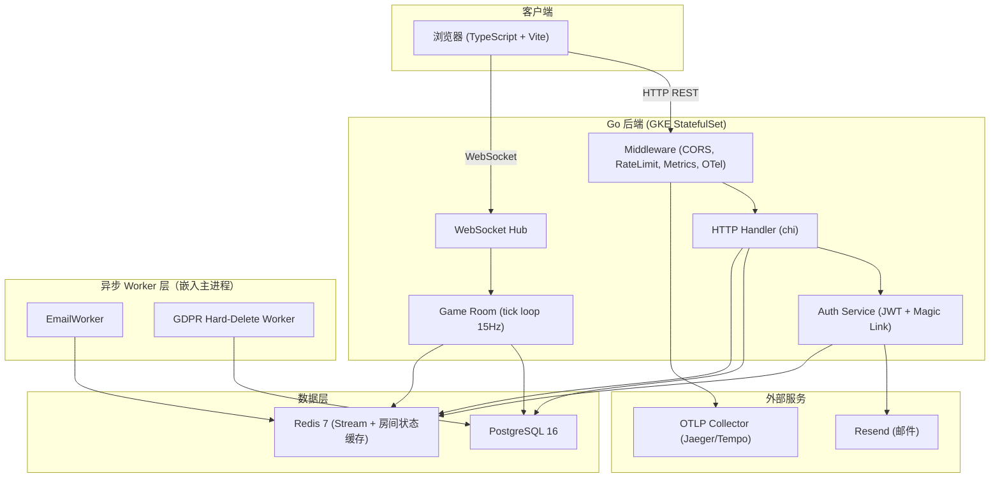
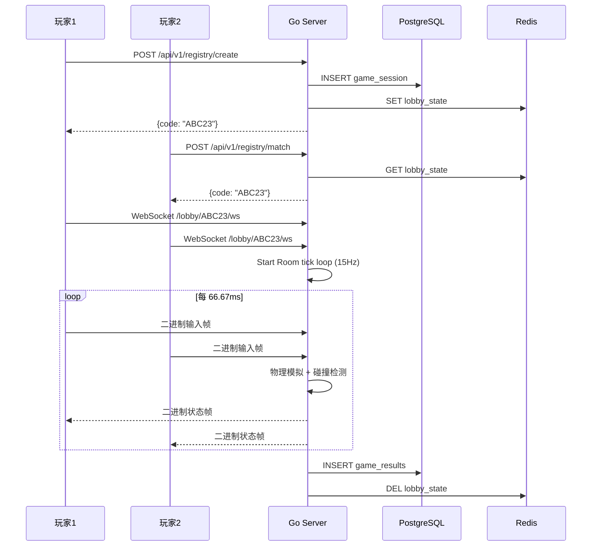

# 系统架构文档

> 最后更新: 2026-07-19 | 维护者: 项目团队

## 系统概述

多人网页气球飞行对战游戏。玩家通过浏览器创建/加入房间，实时 WebSocket 对战。

> **本项目定位**：学习型工程项目，以小游戏为载体实践企业级 SaaS 架构。目标、非目标与"刻意保留清单"见 [ADR-000](../adr/000-project-charter.md)。

> **当前架构**：单区域 GKE StatefulSet + HPA，单库 PostgreSQL 16 + Redis 7 缓存。多区域路由（ADR-014）与 owner 反向代理（ADR-005）已被 ADR-032/033 豁免裁剪，详见 [ADR-014](../adr/014-multi-region-deployment.md)。

## 应用分层（当前实际架构）

ADR-028（2026-07-03）采用 Clean Architecture 接口驱动解耦：接口定义在消费者侧（handler/middleware/rbac），实现在基础设施侧（store/auth），`server` 为唯一组合根。运行时调用方向：

```
HTTP Handler → auth / game (domain logic) → store (PostgreSQL / Redis)
```

- **Handler**（`internal/handler`）：REST / WebSocket 入口，鉴权与协议转换
- **auth / game**（`internal/auth`、`internal/game`）：认证与会话、房间 tick 与物理模拟
- **store**（`internal/store`）：持久化与缓存

## 架构图（单区域组件视图）



## 数据流

### 游戏流程



### 游戏结果持久化

游戏结果由 Room 直接同步写入 `game_results` 表（fire-and-forget goroutine，不阻塞 tick 循环）。outbox/publisher.go 与 GameResultWorker 已被 ADR-033 决策 2 删除，游戏结果不再经 outbox_events 中转。

## 技术选型 ADR

参见 [`../adr/`](../adr/README.md) 目录下的各 ADR 文档。

## 当前局限性

1. **Hub 不具备水平扩展能力**: owner 反向代理子能力（`RouteLocal`/`RouteProxy`、`instanceAddress`）已被 ADR-032/033 豁免裁剪；跨区域路由（ADR-014）已废弃。当前 Hub 为单实例内存态，多实例水平扩展须重写（详见 ADR-005/014 头注）。
2. **单点 tick 循环**: 单房间物理模拟在单 goroutine 中执行，受限于单核——实时权威模拟的固有限制；扩展靠"房间分散到多实例"而非"单房间并行"。
3. **无 CDN**: 静态资源直接由 Go 服务，未利用边缘缓存。

## 流量增长瓶颈分析

瓶颈拐点、单实例容量估算与水平扩展机制（HPA 触发条件、优雅排空）详见 [capacity-planning.md](../operations/capacity-planning.md)。缓存层方案见 [ADR-006](../adr/006-redis-strategy.md)。

## 扩展路线图

1. **短期**: Hub 分片（按 room_id hash 到不同实例）——需重新引入 owner 反向代理（ADR-005，已被 ADR-032 豁免裁剪）与 ADR-014 多区域路由层（已废弃）
2. **长期**: 独立 Game Worker 进程池、tick 计算层与网关层彻底解耦（state 全外置）——仅在单实例房间密度成为瓶颈时才需要；当前不具备多实例水平扩展能力（见上方"当前局限性"§1）。
