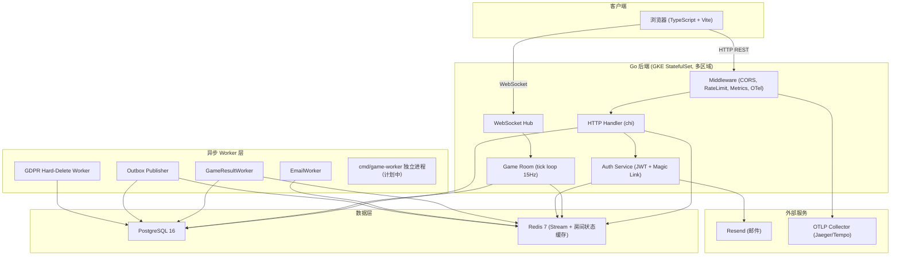
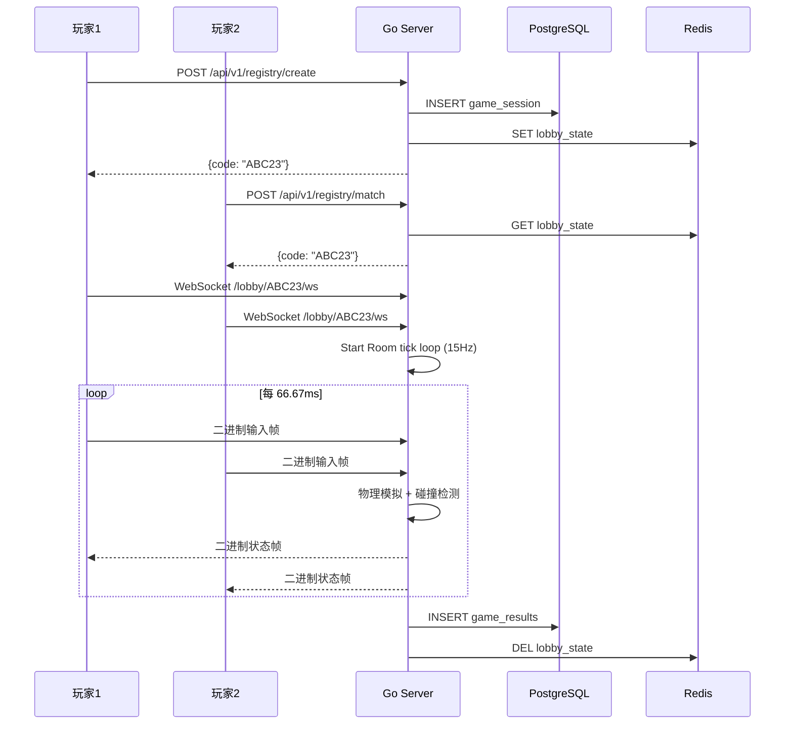

# 系统架构文档

> 最后更新: 2026-07-08
> 维护者: 项目团队

## 系统概述

多人网页气球飞行对战游戏。玩家通过浏览器创建/加入房间，实时 WebSocket 对战。

> **本项目定位**：这是一个学习型工程项目，以小游戏为载体实践企业级多区域高并发 SaaS
> 架构。目标、非目标与"刻意保留清单"见 [ADR-000 项目章程](../adr/000-project-charter.md)。

> **目标架构（部分已落地）**：统一 GKE 多区域（每区域 StatefulSet + HPA + 区域本地
> Redis），全局 Anycast 入口就近接入，PostgreSQL 持久化（`room_directory` 跨区域共享），
> 跨区域绝不转发游戏帧。多区域拓扑决策见 [ADR-014](../adr/014-multi-region-deployment.md)
> 。**注意**：多区域为**目标态（部分已实现，待激活）**，
> 当前实际运行为单区域单库 PostgreSQL，详见下方"提议 vs 已实现"状态。下图为**单区域内**
> 的组件视图。

## 提议 vs 已实现（避免文档与现实脱节）

> 本节明确区分"已落地运行"与"目标态/提议中"，与各 ADR 状态保持一致。

**已实现（当前运行）**

- 单区域 Go 服务（REST + WebSocket 同镜像），房间 tick 循环 15Hz
- 单库 PostgreSQL 16 持久化 + Redis 7（房间状态缓存 + Stream + 读缓存层 ADR-006；stateful/ephemeral 域拆分 ADR-029）
- 区域内 owner 反向代理 + 租约接管（ADR-005）
- 弹性栈：熔断 / 隔板 / 幂等 / 限流；可观测：OTel + Prometheus + Pyroscope
- 合规：审计日志防篡改、GDPR 硬删除 Worker；事务性 Outbox + Redis Stream
- 部署：GKE StatefulSet + HPA（`infra/k8s/base` + `infra/k8s/overlays/<region>`）
- Vanilla TS MPA 前端 + dist 嵌入 Go 单镜像（ADR-018/020）；raw SQL + pgx（ADR-019）
- 字段级 PII 加密部分落地（ADR-022）；混合测试 testcontainers + miniredis（ADR-023）
- 前端受控状态管理（ADR-025）；Room 出站锁外广播（ADR-027）；Clean Architecture 接口驱动解耦（ADR-028）

## 应用分层（当前实际架构）

ADR-028（2026-07-03）
采用 Clean Architecture 接口驱动解耦：接口定义在消费者（handler/middleware/rbac），
实现在基础设施（store/auth），`server` 为唯一组合根。运行时分层为：

```
HTTP Handler → auth / game (domain logic) → store (PostgreSQL / Redis)
```

- **Handler**（`internal/handler`）：REST / WebSocket 入口，鉴权与协议转换
- **auth / game**（`internal/auth`、`internal/game`）：认证与会话、房间 tick 与物理模拟
- **store**（`internal/store`）：持久化与缓存；Outbox 经 Worker 异步消费

## 架构图（单区域组件视图）



## 数据流

### 游戏流程



### 游戏结果持久化：Outbox 单路径

游戏结果通过 Outbox 单路投递（`Room.enqueueGameResultAsync()` → `outbox_events` → Redis Stream → `GameResultWorker` 批量写 PG），at-least-once + 确定性 `uuid.NewSHA1(gameID+userID)` 幂等去重，写入在 goroutine 内异步执行不阻塞 tick 循环。设计决策与实现细节见 [ADR-009](../adr/009-transactional-outbox.md)（Outbox）与 [ADR-005](../adr/005-room-management-and-outbound.md)（Room 出站）。

## 技术选型 ADR

参见 [`../adr/`](../adr/README.md) 目录下的各 ADR 文档。

## 当前局限性

1. **Hub 已可水平扩展（区域内 owner 反向代理 + 租约）**: 多实例下，连接落到非 owner
   实例时透明反向代理到 owner（ADR-005）；owner 失效且**同区域租约过期**时由同区域实例
   接管（取代无作用域 last-writer-wins）。要求实例间可寻址，故统一部署在 GKE
   （ADR-014 多区域拓扑）。跨区域由全局目录路由、就近重定向，绝不转发游戏帧。
2. **单点 tick 循环**: 单个房间的物理模拟仍在单个 goroutine（单 owner 实例）中执行，
   受限于单核——这是实时权威模拟的固有限制；扩展靠"房间分散到多实例"而非"单房间并行"。
3. **消息队列已引入**: 游戏结果通过三写并行持久化（direct write + Redis Stream + Outbox，
   见上方"游戏结果持久化"小节），批量消费仍可优化
4. **无 CDN**: 静态资源直接由 Go 服务，未利用边缘缓存

## 流量增长瓶颈分析

瓶颈拐点、单实例容量估算与水平扩展机制（HPA 触发条件、优雅排空、归属租约）详见 [capacity-planning.md](../operations/capacity-planning.md)。缓存层方案见 [ADR-006](../adr/006-redis-strategy.md)，Outbox 队列解耦见 [ADR-009](../adr/009-transactional-outbox.md)，跨区域路由见 [ADR-014](../adr/014-multi-region-deployment.md)。

## 扩展路线图

1. ~~**短期**: Hub 分片（按 room_id hash 到不同实例）~~ → 已由 owner 反向代理替代（ADR-005）
2. ~~**中期**: 房间状态外置 Redis，Hub 仅做路由~~ → 状态已外置 Redis/PG，路由已实施
3. **长期**: 独立 Game Worker 进程池、tick 计算层与网关层彻底解耦（state 全外置）——
   仅在单实例房间密度成为瓶颈时才需要，当前 owner 反向代理已满足水平扩展。
