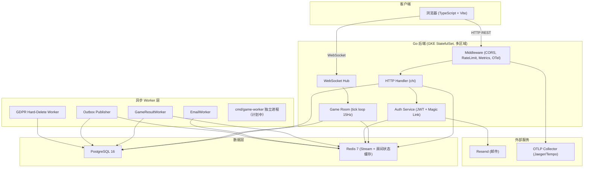
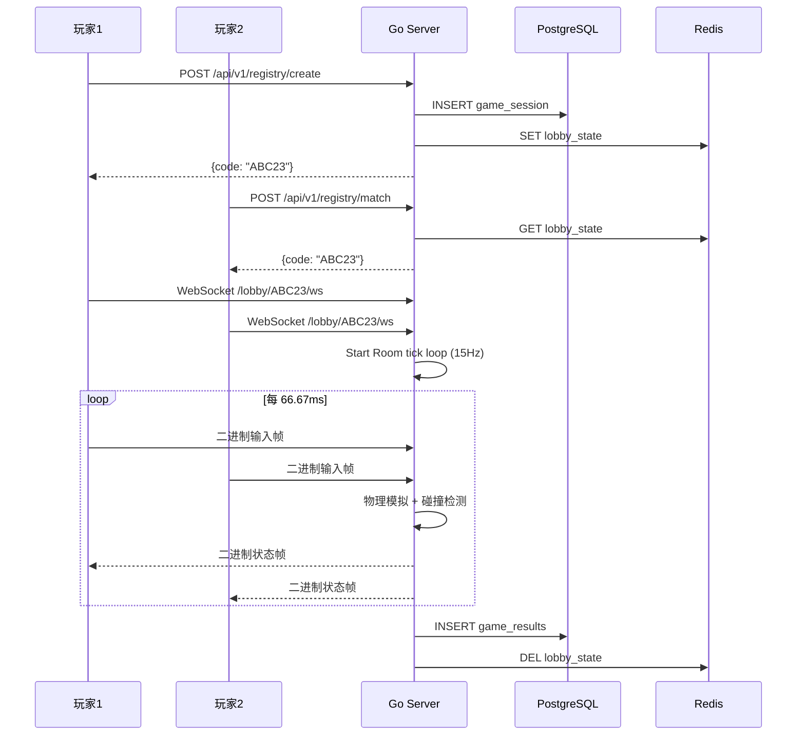

# 系统架构文档

> 最后更新: 2026-07-08
> 维护者: 项目团队

## 系统概述

多人网页气球飞行对战游戏。玩家通过浏览器创建/加入房间，实时 WebSocket 对战。

> **本项目定位**：这是一个学习型工程项目，以小游戏为载体实践企业级多区域高并发 SaaS
> 架构。目标、非目标与"刻意保留清单"见 [ADR-000 项目章程](../adr/000-project-charter.md)。

> **目标架构（部分已落地）**：统一 GKE 多区域（每区域 StatefulSet + HPA + 区域本地
> Redis），全局 Anycast 入口就近接入，CockroachDB 多区域强一致持久化，跨区域绝不转发
> 游戏帧。多区域拓扑图见 [multi-region-topology.md](./multi-region-topology.md)
> （ADR-013/014/015/016）。**注意**：多区域 / CockroachDB 为**目标态（提议/进行中）**，
> 当前实际运行为单区域单库 PostgreSQL，详见下方"提议 vs 已实现"状态。下图为**单区域内**
> 的组件视图。

## 提议 vs 已实现（避免文档与现实脱节）

> 本节明确区分"已落地运行"与"目标态/提议中"，与各 ADR 状态保持一致。

**已实现（当前运行）**

- 单区域 Go 服务（REST + WebSocket 同镜像），房间 tick 循环 15Hz
- 单库 PostgreSQL 16 持久化 + Redis 7（房间状态缓存 + Stream + 读缓存层 ADR-006；stateful/ephemeral 域拆分 ADR-029）
- 区域内 owner 反向代理 + 租约接管（ADR-005）
- 弹性栈：熔断 / 隔板 / 幂等 / 限流；可观测：OTel + Prometheus + Pyroscope
- 合规：审计日志防篡改、GDPR 硬删除 Worker；事务性 Outbox + Redis Stream
- 部署：GKE StatefulSet + HPA（`infra/k8s/base` + `infra/k8s/overlays/<region>`）
- Vanilla TS MPA 前端 + dist 嵌入 Go 单镜像（ADR-018/020）；raw SQL + pgx（ADR-019）
- 字段级 PII 加密部分落地（ADR-022）；混合测试 testcontainers + miniredis（ADR-023）
- 前端受控状态管理（ADR-025）；Room 出站锁外广播（ADR-027）；Clean Architecture 接口驱动解耦（ADR-028）

## 应用分层（当前实际架构）

ADR-024（2026-06-26）裁决删除未接线的 `internal/service` CQRS 脚手架。ADR-028（2026-07-03）
进一步采用 Clean Architecture 接口驱动解耦：接口定义在消费者（handler/middleware/rbac），
实现在基础设施（store/auth），`server` 为唯一组合根。运行时分层为：

```
HTTP Handler → auth / game (domain logic) → store (PostgreSQL / Redis)
```

- **Handler**（`internal/handler`）：REST / WebSocket 入口，鉴权与协议转换
- **auth / game**（`internal/auth`、`internal/game`）：认证与会话、房间 tick 与物理模拟
- **store**（`internal/store`）：持久化与缓存；Outbox 经 Worker 异步消费

**目标态 / 提议中（尚未实际多区域运行）**

- 多区域拓扑与全局就近路由（ADR-014，提议中）
- CockroachDB 多区域强一致持久化（ADR-015，提议中；`DB_DIALECT=postgres` 为默认回退）
- 区域本地房间 + 跨区域重定向（ADR-016，提议中）

## 架构图（单区域组件视图）



## 数据流

### 游戏流程



### 游戏结果持久化：三写并行设计

> 实现：`backend/internal/game/room_result_async.go`；关联 ADR-007（消息队列）、ADR-009（Outbox）。

游戏结束时，Room 通过 `enqueueGameResultAsync()` 在独立 goroutine 中并行触发三条写入路径，
以平衡**一致性保证**与**tick 循环性能**：

```
Room 结束
  └─ enqueueGameResultAsync() [goroutine, asyncWg 跟踪]
       ├─ 1. recordGameResultDirect()
       │     └─ store.RecordGameResult() → PostgreSQL（同步写，失败仅日志，无重试）
       │
       └─ 2. enqueueGameResultRedis()
             ├─ 2a. cache.EnqueueGameResult() → Redis Stream
             │      └─ GameResultWorker 消费 → PostgreSQL（at-least-once + 重试 + 死信）
             │
             └─ 2b. store.InsertOutboxEvent() → outbox_events 表
                    └─ Publisher → Redis Stream（at-least-once，circuit breaker 包装）
```

**三条路径的设计意图**

| 路径 | 目的 | 一致性 | 失败处理 |
|------|------|--------|---------|
| Direct write（1） | DB 健康时立即持久化，作为"安全网" | at-most-once（无重试） | 失败仅 `slog.Error`，依赖路径 2 兜底 |
| Redis Stream（2a） | 异步批量写入，削峰保护 PG（ADR-007） | at-least-once（XACK + 重试 + 死信） | 5 次指数退避后转死信队列 |
| Outbox（2b） | 跨消费者 at-least-once 传递（ADR-009） | at-least-once（Publisher + circuit breaker） | Publisher 持续轮询重试 |

**去重机制**：三条路径可能重复写入 `game_results`。`GameResultWorker.processMessage` 用
`uuid.NewSHA1(gameID + userID)` 生成确定性 result ID，配合 `INSERT ... ON CONFLICT DO NOTHING`
保证幂等。Direct write 已写入时，Worker 重处理不会产生重复行。

**一致性 vs 性能权衡**：
- **性能优先**：三写并行避免任一路径阻塞 Room 释放；direct write 在 goroutine 内同步执行，
  但不阻塞 tick 循环（已通过 `asyncWg` 异步化）。
- **一致性兜底**：Redis Stream + Outbox 双路 at-least-once 保证最终一致；direct write 失败时
  Worker 仍会写入。但 direct write 路径**无重试**，若 DB 短暂不可用且 Worker 同时失败，
  存在理论数据丢失窗口（依赖 outbox Publisher 恢复后补偿）。

> ⚠️ **已知风险（v2 自检 v2-R-146 跨层发现）**：direct write 失败仅日志无重试，与
> Worker/Outbox 的 at-least-once 语义不一致。当前靠 Worker 路径兜底，但 direct write 的
> "安全网"作用在 DB 抖动场景下实际失效。at-least-once 语义未在 ADR-009 中显式文档化。

## 技术选型 ADR

参见 [`../adr/`](../adr/README.md) 目录下的各 ADR 文档。

## 当前局限性

1. **Hub 已可水平扩展（区域内 owner 反向代理 + 租约）**: 多实例下，连接落到非 owner
   实例时透明反向代理到 owner（ADR-005）；owner 失效且**同区域租约过期**时由同区域实例
   接管（取代无作用域 last-writer-wins）。要求实例间可寻址，故统一部署在 GKE
   （ADR-013 终态）。跨区域由全局目录路由、就近重定向，绝不转发游戏帧（ADR-016）。
2. **单点 tick 循环**: 单个房间的物理模拟仍在单个 goroutine（单 owner 实例）中执行，
   受限于单核——这是实时权威模拟的固有限制；扩展靠"房间分散到多实例"而非"单房间并行"。
3. **消息队列已引入**: 游戏结果通过三写并行持久化（direct write + Redis Stream + Outbox，
   见上方"游戏结果持久化"小节），批量消费仍可优化
4. **无 CDN**: 静态资源直接由 Go 服务，未利用边缘缓存

## 流量增长瓶颈分析

| 流量倍数 | 最先崩溃的组件 | 原因 | 应对方案 |
|----------|---------------|------|---------|
| 10x | Hub 内存 | 房间数增加 10 倍，内存 OOM | 房间状态外置到 Redis |
| 100x | WebSocket 连接数 | 单机 fd 限制 (~65K) | Hub 分片 + 多实例 |
| 100x | PostgreSQL 写入 | game_results INSERT 并发 | 读写分离 + 批量写入 |
| 1000x | 物理模拟 CPU | tick 循环占满单核 | 房间调度到独立 Worker |

### 100x 场景深度分析

当前单实例支持约 100 房间 / 500 并发连接。100x 意味着 10,000 房间 / 50,000 连接，需要以下架构升级：

#### 缓存层方案

ListLobbies、CheckRoom 当前直接查 PG，高 QPS 下成为瓶颈。

- **策略**: Redis 作为读缓存，TTL 30s，写穿透（Write-Through）
- **实现**: 房间创建/删除时同步更新 Redis 缓存 + PG；读请求优先查 Redis，miss 时回源 PG 并回填
- **缓存键**: `lobby:list` (列表缓存)、`lobby:check:{code}` (单房间缓存)
- **一致性窗口**: 30s TTL 内可能读到旧数据，对游戏大厅列表可接受
- **详见**: [`../adr/006-cache-layer.md`](../adr/006-cache-layer.md)

#### 队列解耦方案

游戏结果通过三写并行持久化（详见上方"游戏结果持久化：三写并行设计"小节），Redis Stream
为异步批量写入主路径。

- **策略**: 游戏结果写入 Redis Stream → Worker 消费批量写入 PG（同时有 direct write + outbox 兜底）
- **实现**: Room 结束时 `enqueueGameResultAsync` 触发三写并行；Worker XREADGROUP 消费，`ON CONFLICT DO NOTHING` 去重
- **容错**: Worker 消费失败时消息留在 Pending 列表，其他 Worker 可 XCLAIM 接管；5 次重试后转死信
- **详见**: [`../adr/007-message-queue.md`](../adr/007-message-queue.md)、[`../adr/009-transactional-outbox.md`](../adr/009-transactional-outbox.md)

#### 容量规划

| 资源 | 单实例容量 | 100x 所需 | 方案 |
|------|-----------|----------|------|
| WebSocket 连接 | ~500 (1K 上限) | 50,000 | 100 实例 + Hub 分片 |
| 房间数 | ~100 | 10,000 | 100 实例，按 room_id hash 分片 |
| PG 写入 QPS | ~500 INSERT/s | ~50,000 | Redis Stream + 批量写入 |
| PG 读取 QPS | ~2,000 SELECT/s | ~200,000 | Redis 读缓存层 |

#### 降级策略

流量超限时优先保障核心体验（游戏进行中），降级非核心功能：

1. **优先保障**: WebSocket 连接（游戏进行中的房间），已有连接不踢出
2. **降级 REST API**: 列表/查询接口返回缓存数据或 503，新房间创建限流
3. **降级指标**: 停止非关键 Prometheus 采集，减少内存开销
4. **熔断触发**: PG 连接池 > 90% 使用率时，新游戏创建返回 503；Redis 延迟 > 100ms 时切换为只读模式

## 扩展路线图

1. ~~**短期**: Hub 分片（按 room_id hash 到不同实例）~~ → 已由 owner 反向代理替代（ADR-005）
2. ~~**中期**: 房间状态外置 Redis，Hub 仅做路由~~ → 状态已外置 Redis/PG，路由已实施
3. **长期**: 独立 Game Worker 进程池、tick 计算层与网关层彻底解耦（state 全外置）——
   仅在单实例房间密度成为瓶颈时才需要，当前 owner 反向代理已满足水平扩展。
