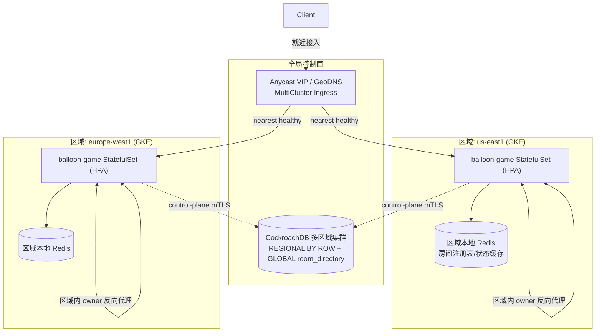

# 多区域拓扑与全局路由

> 关联 ADR-014（多区域拓扑）、ADR-015（CockroachDB）、ADR-016（区域本地房间）、ADR-029（Redis 域拆分 Phase 3 多区域）。

## 数据流总览



## 关键路径

1. **就近接入**：客户端连 Anycast VIP，GCLB 路由到最近健康区域（`infra/k8s/global/multicluster-ingress.yaml`）。
2. **建房**：`Hub.CreateRoom` 在本区域落地，写 CRDB `room_directory`（GLOBAL）登记
   `code→region/endpoint` 并保证跨区域唯一（撞码重试）。
3. **加房/连接**：前端先调 `GET /api/v1/lobby/{code}/resolve` 拿到房间 home region 的
   `ws_endpoint`：
   - 同区域 → 同源直连，区域内 owner 反向代理到 owner 实例（ADR-005）。
   - 异区域 → 返回该区域 `ws_endpoint`，客户端直连房间 home region（ADR-016）。
4. **故障切换**：区域内 owner 失联且租约过期 → 同区域实例接管（`ClaimRoomOwnership`）；
   跨区域永不接管、永不转发游戏帧。

## 跨区域控制面安全（mTLS）

- **CRDB**：节点间与客户端连接使用 TLS（`sslmode=verify-full` + 证书），见
  [`../data/cockroachdb-migration.md`](../data/cockroachdb-migration.md)。
- **可观测性聚合**：Thanos/Mimir 跨区域查询走 mTLS（见 [`../operations/slo.md`](../operations/slo.md) / P4）。
- **区域内 internal 反向代理**：`INTERNAL_PROXY_SECRET` + `NetworkPolicy`
  （`infra/k8s/global/network-policy.yaml`）限制为同命名空间，杜绝跨区直达。

## 部署

```bash
# 每区域集群分别 apply 对应 overlay
kubectl --context us-east1   apply -k infra/k8s/overlays/us-east1
kubectl --context europe-west1 apply -k infra/k8s/overlays/europe-west1
kubectl --context asia-southeast1 apply -k infra/k8s/overlays/asia-southeast1

# 在 config cluster 上 apply 全局入口与策略
kubectl --context config-cluster apply -f infra/k8s/global/
```
